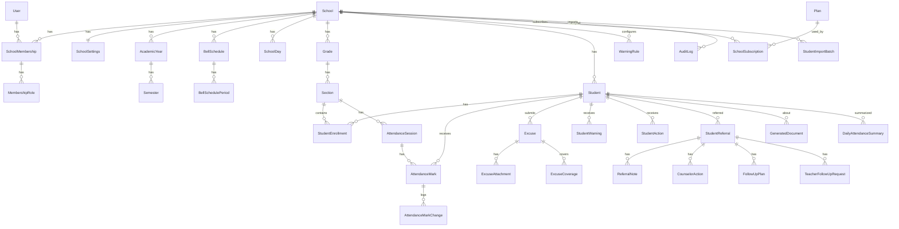

# ERD — الكيانات والعلاقات

> المرجع التصميمي لقاعدة البيانات. الحقول هنا تصميمية؛ التفاصيل النهائية (أطوال، null) تُثبت في Migrations كل مرحلة دون مخالفة القيود المذكورة.

**اصطلاحات عامة:**
- كل الجداول: `id BIGINT PK`, `created_at`, `updated_at`.
- كل جدول مدرسي: `school_id FK NOT NULL` (عزل المستأجرين — ADR-002).
- الحذف الفعلي ممنوع للبيانات التاريخية؛ نستخدم `is_active` / حالات (ADR-010).
- `PROTECT` على FKs التاريخية (لا cascade يمسح تاريخًا).

---

## 1. المخطط العام



---

## 2. accounts — ✅ نفذ في المرحلة 2

### User (عالمي — بلا school_id) — `AbstractUser` بإزالة username
| الحقل | النوع | ملاحظات |
|---|---|---|
| mobile | varchar(16) | **Unique عالميًا**، مطبّع `+9665XXXXXXXX`، USERNAME_FIELD |
| password | varchar | Argon2id hash |
| first_name / last_name | varchar | |
| email | varchar blank | ليس للدخول |
| is_active / is_staff / is_superuser | bool | `is_platform_admin` = is_superuser (خاصية) |
| date_joined / last_login | datetime | + created_at/updated_at (TimestampedModel) |

فهارس: unique على `mobile`.

---

## 3. schools — School الأساس ✅ نفذ في المرحلة 2 (name/slug/status)؛ البقية في المرحلة 3

### School (جذر المستأجر — بلا school_id)
| الحقل | النوع | ملاحظات |
|---|---|---|
| name | varchar(200) | |
| slug | varchar(100) | **Unique** — نفذ في المرحلة 2 |
| logo | file ref | Object Storage، Signed URL |
| ministry_number | varchar(30) null | اختياري |
| stage | enum | ELEMENTARY / MIDDLE / HIGH |
| city | varchar(100) | |
| manager_membership | FK→SchoolMembership null | ربط بحساب لا نص |
| vice_membership | FK→SchoolMembership null | الوكيل المسؤول |
| status | enum | ACTIVE / SUSPENDED (تُشتق أيضًا من الاشتراك) |

### SchoolSettings (1:1 مع School)
| الحقل | النوع | ملاحظات |
|---|---|---|
| school | FK unique | |
| unprepared_period_alert_minutes | int | مثال 25 |
| attendance_edit_window_minutes | int | مثال 15 |
| timezone | varchar | default `Asia/Riyadh` |

### SchoolDay
| الحقل | النوع | ملاحظات |
|---|---|---|
| school | FK | |
| day_of_week | int (0=الأحد…) | **Unique (school, day_of_week)** |
| is_school_day | bool | |
| periods_count | int | عدد حصص هذا اليوم |

### BellSchedule
| الحقل | النوع | ملاحظات |
|---|---|---|
| school | FK | |
| name | varchar | عادي / رمضان / اختبارات / مؤقت |
| is_active | bool | **جدول نشط واحد فقط لكل مدرسة** (partial unique index: `(school) WHERE is_active`) |

### BellSchedulePeriod
| الحقل | النوع | ملاحظات |
|---|---|---|
| bell_schedule | FK | |
| period_number | int | **Unique (bell_schedule, period_number)** |
| start_time | time | |
| end_time | time | check: end > start |

> الحصة الحالية = period التي `start_time ≤ now < end_time` بتوقيت المدرسة، من الجدول النشط، إذا كان اليوم يوم دراسة و `period_number ≤ periods_count` لليوم.

---

## 4. memberships — ✅ نفذ في المرحلة 2

### SchoolMembership
| الحقل | النوع | ملاحظات |
|---|---|---|
| user | FK→User | |
| school | FK→School | **Unique (user, school)** — قيد DB فعلي |
| status | enum | ACTIVE / INVITED / SUSPENDED / LEFT |
| joined_at | datetime | |

فهرس: `(school, status)`.

### SchoolMembershipRole (اسم التنفيذ لـ MembershipRole)
| الحقل | النوع | ملاحظات |
|---|---|---|
| membership | FK | |
| role | enum | SCHOOL_MANAGER / VICE_PRINCIPAL / COUNSELOR / TEACHER — **Unique (membership, role)** |

> `PLATFORM_ADMIN` ليس هنا — سمة على User (ADR-003).

---

## 5. academics

### AcademicYear
`school`, `name`, `start_date`, `end_date`, `is_active` (partial unique على النشط لكل مدرسة).

### Semester
`academic_year FK`, `name`, `start_date`, `end_date`, `is_active`.

### Grade
`school`, `name` (مثل «الأول الثانوي»), `sort_order`. **Unique (school, name)**.

### Section
| الحقل | النوع | ملاحظات |
|---|---|---|
| school | FK | denormalized للعزل والفهارس |
| grade | FK | |
| name | varchar | مثل «1» — **Unique (school, grade, name)** |
| qr_token | varchar(64) | عشوائي غير قابل للتخمين (secrets)، unique — لدعم QR مستقبلًا |
| is_active | bool | |

---

## 6. students

### Student
| الحقل | النوع | ملاحظات |
|---|---|---|
| school | FK | الطالب كيان مدرسي (لا مشاركة بين مدارس في MVP) |
| national_id_encrypted | binary/text | Fernet — ADR-009 |
| national_id_lookup_hash | char(64) | HMAC-SHA256 — **Unique (school, hash)** |
| full_name | varchar(200) | فهرس بحث (بالاسم) |
| student_number | varchar(30) null | من نور إن وجد |
| guardian_name | varchar(150) null | |
| guardian_phone | varchar(16) null | مطبّع |
| is_active | bool | «لم يعد في الملف» = false، لا حذف |

فهارس: `(school, full_name)`, unique `(school, national_id_lookup_hash)`.

### StudentEnrollment (تاريخ الطالب الدراسي)
| الحقل | النوع | ملاحظات |
|---|---|---|
| school | FK | |
| student | FK | |
| section | FK | |
| academic_year | FK | |
| start_date / end_date | date / null | end_date=null → قيد حالي |
| status | enum | ACTIVE / TRANSFERRED / LEFT |

قيد: **قيد ACTIVE واحد للطالب** (partial unique: `(student) WHERE status='ACTIVE'`). تغيير الفصل = إغلاق القيد وفتح آخر (ADR-010).

### StudentImportBatch (+ StudentImportRow)
`school`, `uploaded_by`, `file ref`, `status` (UPLOADED/VALIDATED/PREVIEW/APPROVED/IMPORTED/FAILED), `stats json` (جدد/تغير فصلهم/بلا تغيير/مفقودون/أخطاء/تكرارات). الصفوف المفصلة في `StudentImportRow` مع نتيجة المطابقة لكل صف. الاستيراد الفعلي داخل `transaction.atomic` عبر Celery.

> استيراد المعلمين يعاد استخدام النمط نفسه بـ `StaffImportBatch` في وحدة staff.

---

## 7. attendance

### AttendanceSession
| الحقل | النوع | ملاحظات |
|---|---|---|
| school | FK | |
| section | FK | |
| date | date | |
| period_number | int | |
| status | enum | NOT_STARTED / IN_PROGRESS / SUBMITTED |
| started_by / submitted_by | FK→SchoolMembership | |
| started_at / submitted_at | datetime | |
| bell_period_snapshot | json | وقت بداية/نهاية الحصة وقت التحضير (يثبت حساب late_minutes حتى لو تغير الجدول) |

قيود وفهارس:
- **Unique (school, section, date, period_number)** ← منع التحضير مرتين (Race-safe).
- فهرس `(school, date, period_number, status)` — لوحة الوكيل والفصول غير المحضرة.
- فهرس `(school, section, date)`.

### AttendanceMark (استثناءات فقط — ADR-006)
| الحقل | النوع | ملاحظات |
|---|---|---|
| school | FK | denormalized |
| session | FK | |
| student | FK | **Unique (session, student)** |
| status | enum | ABSENT / LATE |
| excuse_status | enum | UNEXCUSED / EXCUSED — default UNEXCUSED |
| arrival_time | time null | مطلوب عند LATE |
| late_minutes | int null | محسوب: arrival − بداية الحصة (من snapshot) |

فهارس: `(school, student)`, `(school, session)`, `(school, status, excuse_status)`.

### AttendanceMarkChange (سجل تعديل — ADR-010)
`mark FK`, `changed_by`, `changed_at`, `field`, `old_value`, `new_value`, `reason`. يشمل تحويل UNEXCUSED→EXCUSED وتعديلات ما بعد نافذة المعلم.

### DailyAttendanceSummary (مجدولة عبر Celery — للوحات والتقارير)
| الحقل | النوع | ملاحظات |
|---|---|---|
| school / student / date | | **Unique (school, student, date)** |
| day_status | enum | PRESENT / FULL_DAY_ABSENCE / PARTIAL_ABSENCE / INCOMPLETE |
| absent_periods / late_periods | int | |
| late_minutes_total | int | |
| excused_absent_periods | int | |
| sessions_expected / sessions_submitted | int | INCOMPLETE عندما expected > submitted |

فهارس: `(school, date)`, `(school, student, date)`, `(school, date, day_status)`.
إعادة الحساب Idempotent (upsert) عند: اعتماد جلسة، تعديل علامة، اعتماد عذر.

---

## 8. excuses

### Excuse
| الحقل | النوع | ملاحظات |
|---|---|---|
| school / student | FK | |
| kind | enum | FULL_DAY / MULTI_DAY / PERIODS |
| start_date / end_date | date | |
| reason | text | |
| status | enum | PENDING / APPROVED / REJECTED |
| decided_by / decided_at | | الوكيل |

### ExcuseCoverage
يفصّل ما يغطيه العذر: `excuse FK`, `date`, `period_number null` (null = يوم كامل). عند الاعتماد تُحدّث علامات الغياب المطابقة إلى `excuse_status=EXCUSED` (مع AttendanceMarkChange لكل علامة، داخل transaction، Idempotent).

### ExcuseAttachment
`excuse FK`, `file ref` (Object Storage خاص), `original_filename`, `content_type`, `size`. تحقق: الامتداد + MIME + الحجم؛ Signed URLs فقط.

---

## 9. warnings

### WarningRule
| الحقل | النوع | ملاحظات |
|---|---|---|
| school | FK | |
| kind | enum | ABSENCE / LATE |
| level | int 1–3 | **Unique (school, kind, level)** |
| threshold | int | أيام غياب أو مرات تأخر |
| threshold_unit | enum | DAYS / COUNT / MINUTES (MINUTES لدعم مجموع دقائق التأخر مستقبلًا) |

Validation: `level1.threshold < level2.threshold < level3.threshold` لكل kind.

### StudentWarning (Snapshot — ADR-010)
| الحقل | النوع | ملاحظات |
|---|---|---|
| school / student | FK | |
| kind / level | | **Unique (school, student, kind, level, academic_year)** ← منع إصدار الإنذار مرتين |
| absence_days_at_issue | int | Snapshot |
| absence_periods_at_issue | int | Snapshot |
| late_count_at_issue | int | Snapshot |
| late_minutes_at_issue | int | Snapshot |
| issued_by / issued_at | | |
| document | FK→GeneratedDocument null | نسخة PDF المطبوعة |

---

## 10. actions

### StudentAction
`school`, `student`, `type` enum (PARENT_CALL / PARENT_NOTIFY / PARENT_MEETING / PLEDGE / REFER_COUNSELOR / REFER_ADMIN / OTHER), `notes`, `related_warning FK null`, `related_referral FK null`, `created_by`, `created_at`, `document FK null`.

---

## 11. referrals

### StudentReferral
| الحقل | النوع | ملاحظات |
|---|---|---|
| school / student | FK | |
| created_by | FK→SchoolMembership | |
| assigned_counselor | FK→SchoolMembership null | |
| source | enum | VICE_PRINCIPAL / TEACHER |
| category | enum | ATTENDANCE (غياب متكرر/تأخر/عدم استجابة/تجاوز حد) / ACADEMIC (ضعف/تراجع/عدم إنجاز) / ENGAGEMENT (نوم/عدم مشاركة/تشتت) / BEHAVIOR / OTHER — القيم التفصيلية في `reason` |
| reason | enum مفصل | القائمة الكاملة من المتطلبات |
| notes | text | |
| status | enum | NEW / UNDER_REVIEW / FOLLOW_UP / WAITING_PARENT / RESOLVED / CLOSED |
| created_at / closed_at | | |

فهارس: `(school, status)`, `(school, student, status)`, `(school, assigned_counselor, status)`.
**كشف التكرار:** قبل الإنشاء، إن وُجد Referral مفتوح (ليس RESOLVED/CLOSED) لنفس (student, category) → تنبيه + خيار إضافة ReferralNote بدل حالة جديدة.

### ReferralNote
`referral FK`, `author FK→SchoolMembership`, `text`, `created_at`.

---

## 12. counseling

### CounselorAction
`school`, `referral FK`, `type` enum (STUDENT_MEETING / COUNSELING_SESSION / PARENT_CALL / PARENT_MEETING / TEACHER_FOLLOWUP_REQUEST / FOLLOWUP_PLAN / REFER_ADMIN / CASE_CLOSE), `notes`, `created_by`, `created_at`.

### FollowUpPlan
`school`, `referral FK`, `goal`, `start_date`, `end_date`, `review_date`, `status` enum (ACTIVE / COMPLETED / CANCELLED).

### TeacherFollowUpRequest
| الحقل | النوع | ملاحظات |
|---|---|---|
| school / referral | FK | |
| teacher | FK→SchoolMembership | المستهدف |
| duration_days | int | مثل 7 |
| status | enum | PENDING / RESPONDED / EXPIRED |
| response | enum null | IMPROVED / PARTIAL / NOT_IMPROVED |
| response_note | text | |
| responded_at | datetime | |

---

## 13. documents

### GeneratedDocument (ADR-010)
| الحقل | النوع | ملاحظات |
|---|---|---|
| school / student | FK | |
| type | enum | WARNING_1 / WARNING_2 / WARNING_3 / ATTENDANCE_PLEDGE / ABSENCE_SHEET / STUDENT_REPORT / ACTIONS_LOG |
| file | ref | PDF عربي RTL في Object Storage خاص، Signed URL |
| data_snapshot | json | البيانات وقت التوليد — لا يُعاد التوليد من الحاضر |
| generated_by / generated_at | | |

---

## 14. notifications

### Notification
`school null` (تنبيهات منصة بلا مدرسة), `recipient FK→User`, `type`, `title`, `body`, `payload json`, `read_at null`. فهرس `(recipient, read_at)`.
أمثلة: فصول غير محضرة (للوكيل)، إحالة جديدة (للمرشد)، طلب متابعة (للمعلم)، رد متابعة (للمرشد).

---

## 15. subscriptions

### Plan (بلا school_id)
`name`, `max_students int null`, `max_staff int null`, `price_monthly decimal`, `is_active`, `features json`.

### SchoolSubscription
`school FK`, `plan FK`, `status` enum (TRIAL / ACTIVE / PAST_DUE / EXPIRED / SUSPENDED), `trial_ends_at`, `current_period_start/end`, `notes`. فهرس `(status)`, `(school)`. لا بوابة دفع في MVP.
Middleware المدرسة يمنع العمليات الكتابية عند EXPIRED/SUSPENDED (قراءة فقط + رسالة واضحة).

---

## 16. audit

### AuditLog (append-only)
| الحقل | النوع | ملاحظات |
|---|---|---|
| school | FK null | أحداث المنصة بلا مدرسة |
| actor | FK→User null | |
| action | varchar | LOGIN / LOGOUT / SWITCH_SCHOOL / STUDENT_IMPORT / ATTENDANCE_STARTED / ATTENDANCE_SUBMITTED / ATTENDANCE_EDITED / EXCUSE_APPROVED / WARNING_ISSUED / ACTION_CREATED / REFERRAL_CREATED / REFERRAL_UPDATED / REFERRAL_CLOSED / SETTINGS_CHANGED / ROLE_CHANGED / … |
| target_type / target_id | varchar / bigint | polymorphic خفيف |
| metadata | json | **بلا** كلمات مرور أو هوية كاملة أو ملاحظات حساسة |
| ip / user_agent | | |
| created_at | datetime | فهرس `(school, created_at)`, `(school, action)` |

---

## 17. خلاصة الفهارس الحرجة (المرحلة 19 تضيف حسب القياس)

```text
attendance_session:  UNIQUE(school, section, date, period)   + (school, date, period, status)
attendance_mark:     UNIQUE(session, student)                + (school, student) + (school, status, excuse_status)
daily_summary:       UNIQUE(school, student, date)           + (school, date, day_status)
student:             UNIQUE(school, national_id_lookup_hash) + (school, full_name) + (school, is_active)
enrollment:          partial UNIQUE(student WHERE ACTIVE)    + (school, section, status)
membership:          UNIQUE(user, school)
warning:             UNIQUE(school, student, kind, level, academic_year)
referral:            (school, status) + (school, student, status)
audit:               (school, created_at)
```
