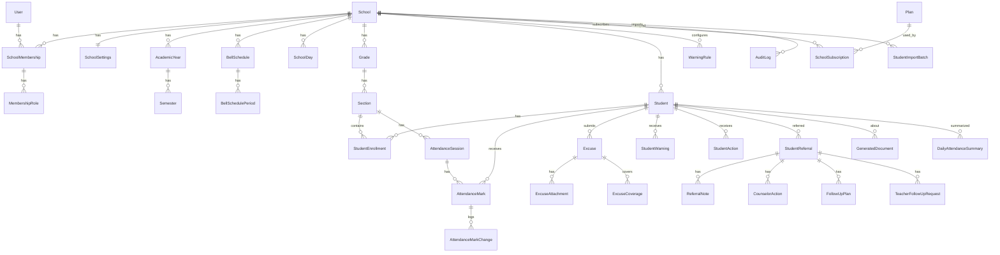

# ERD — الكيانات والعلاقات

> المرجع التصميمي لقاعدة البيانات. الحقول هنا تصميمية؛ التفاصيل النهائية (أطوال، null) تُثبت في Migrations كل مرحلة دون مخالفة القيود المذكورة.

**اصطلاحات عامة:**
- كل الجداول: `id BIGINT PK`, `created_at`, `updated_at`.
- كل جدول مدرسي: `school_id FK NOT NULL` (عزل المستأجرين — ADR-002).
- الحذف الفعلي ممنوع للبيانات التاريخية؛ نستخدم `is_active` / حالات (ADR-010).
- `PROTECT` على FKs التاريخية (لا cascade يمسح تاريخًا).

---

## 1. المخطط العام



---

## 2. accounts — ✅ نفذ في المرحلة 2

### User (عالمي — بلا school_id) — `AbstractUser` بإزالة username
| الحقل | النوع | ملاحظات |
|---|---|---|
| mobile | varchar(16) | **Unique عالميًا**، مطبّع `+9665XXXXXXXX`، USERNAME_FIELD |
| password | varchar | Argon2id hash |
| first_name / last_name | varchar | |
| email | varchar blank | ليس للدخول |
| is_active / is_staff / is_superuser | bool | `is_platform_admin` = is_superuser (خاصية) |
| date_joined / last_login | datetime | + created_at/updated_at (TimestampedModel) |

فهارس: unique على `mobile`.

---

## 3. schools — School الأساس ✅ نفذ في المرحلة 2 (name/slug/status)؛ البقية في المرحلة 3

### School (جذر المستأجر — بلا school_id)
| الحقل | النوع | ملاحظات |
|---|---|---|
| name | varchar(200) | |
| slug | varchar(100) | **Unique** — نفذ في المرحلة 2 |
| logo | file ref | Object Storage، Signed URL |
| ministry_number | varchar(30) null | اختياري |
| stage | enum | ELEMENTARY / MIDDLE / HIGH |
| city | varchar(100) | |
| manager_membership | FK→SchoolMembership null | ربط بحساب لا نص |
| vice_membership | FK→SchoolMembership null | الوكيل المسؤول |
| status | enum | ACTIVE / SUSPENDED (تُشتق أيضًا من الاشتراك) |

### SchoolSettings (1:1 مع School) — ✅ نفذ في المرحلة 3
| الحقل | النوع | ملاحظات |
|---|---|---|
| school | FK unique | |
| ministry_school_number / city / official_principal_name | varchar blank | الأخير للطباعة فقط |
| education_stage | enum | ELEMENTARY/MIDDLE/SECONDARY/MULTI_STAGE |
| logo | ImageField | تحقق رباعي؛ Local media للتطوير |
| unprepared_period_alert_minutes | int 1–120 | check constraint، افتراضي 25 |
| attendance_edit_window_minutes | int 0–120 | check constraint، افتراضي 15 |
| timezone | varchar | default `Asia/Riyadh` |

### SchoolWeekDay — ✅ نفذ في المرحلة 3 (يدمج SchoolDay + ربط الجدول)
| الحقل | النوع | ملاحظات |
|---|---|---|
| school | FK | |
| weekday | int (0=الأحد…6=السبت) | **Unique (school, weekday)** |
| is_school_day | bool | |
| bell_schedule | FK null | «الجدول النشط لكل يوم» — نفس الجدول لعدة أيام؛ عدد الحصص يستنتج من الجدول |

### BellSchedule — ✅ نفذ في المرحلة 3
| الحقل | النوع | ملاحظات |
|---|---|---|
| school | FK | |
| name | varchar | عادي / رمضان / اختبارات / مؤقت |
| status | enum | ACTIVE/INACTIVE/ARCHIVED — «النشط» يحدد بربط الأيام لا بقيد وحيد |
| valid_from / valid_to | date null | لصلاحية زمنية مستقبلية |

### BellPeriod — ✅ نفذ في المرحلة 3 (اسم التنفيذ لـ BellSchedulePeriod)
| الحقل | النوع | ملاحظات |
|---|---|---|
| school | FK | denormalized من الجدول |
| bell_schedule | FK | |
| sequence | int | **Unique (bell_schedule, sequence)** |
| name | varchar | الحصة الأولى / الفسحة |
| start_time / end_time | time | check: end > start؛ منع التداخل في الـ Service |
| is_attendance_period | bool | الفسحة = false |

> الحصة الحالية = period التي `start_time ≤ now < end_time` بتوقيت المدرسة، من الجدول النشط، إذا كان اليوم يوم دراسة و `period_number ≤ periods_count` لليوم.

---

## 4. memberships — ✅ نفذ في المرحلة 2

### SchoolMembership
| الحقل | النوع | ملاحظات |
|---|---|---|
| user | FK→User | |
| school | FK→School | **Unique (user, school)** — قيد DB فعلي |
| status | enum | ACTIVE / INVITED / **DECLINED** (م5) / SUSPENDED / LEFT |
| joined_at | datetime | |

### StaffProfile — ✅ نفذ في المرحلة 5 (staff app)
`school FK`, `membership OneToOne`, `display_name`, `employee_number` (partial unique لكل مدرسة),
`job_title`, `source` (IMPORT/MANUAL), `is_active` — بيانات الموظف الخاصة بالمدرسة، لا role فيه.
+ `StaffImportJob/Row` بنمط استيراد الطلاب. و`User.must_change_password` (م5).

فهرس: `(school, status)`.

### SchoolMembershipRole (اسم التنفيذ لـ MembershipRole)
| الحقل | النوع | ملاحظات |
|---|---|---|
| membership | FK | |
| role | enum | SCHOOL_MANAGER / VICE_PRINCIPAL / COUNSELOR / TEACHER — **Unique (membership, role)** |

> `PLATFORM_ADMIN` ليس هنا — سمة على User (ADR-003).

---

## 5. academics — AcademicYear/Semester ✅ نفذا في المرحلة 3

### AcademicYear
`school`, `name`, `start_date`, `end_date`, `status` (UPCOMING/ACTIVE/CLOSED/ARCHIVED) —
**partial unique `(school) WHERE status='ACTIVE'`** + check start<end.

### Semester
`school` (denorm), `academic_year FK`, `name`, `sequence` (**unique داخل العام**),
`start_date`, `end_date`, `status` — **partial unique ACTIVE لكل مدرسة** + ضمن حدود العام (service).

### Grade
`school`, `name` (مثل «الأول الثانوي»), `sort_order`. **Unique (school, name)**.

### Section
| الحقل | النوع | ملاحظات |
|---|---|---|
| school | FK | denormalized للعزل والفهارس |
| grade | FK | |
| name | varchar | مثل «1» — **Unique (school, grade, name)** |
| qr_token | varchar(64) null | ✅ م6: `secrets.token_urlsafe(24)`، unique، nullable — يولد عند أول طلب مدير (التفصيل: ATTENDANCE_QR.md) |
| is_active | bool | |

---

## 6. students — ✅ نفذ في المرحلة 4 (كما مبين، مع national_id_masked إضافي على Student،
## وStudentImportJob/Row بدل ImportBatch — القيود الفريدة كلها في DB. التفصيل: STUDENTS.md وSTUDENT_IMPORT.md)
## م4.1: Student.status صار (ACTIVE/GRADUATED/TRANSFERRED/WITHDRAWN/INACTIVE/ARCHIVED)
## + status_changed_at/by + exit_date/reason،
## + StudentPurgeJob (قيد: عملية جارية واحدة لكل مدرسة؛ student_ids تمسح بعد الاكتمال).

### Student
| الحقل | النوع | ملاحظات |
|---|---|---|
| school | FK | الطالب كيان مدرسي (لا مشاركة بين مدارس في MVP) |
| national_id_encrypted | binary/text | Fernet — ADR-009 |
| national_id_lookup_hash | char(64) | HMAC-SHA256 — **Unique (school, hash)** |
| full_name | varchar(200) | فهرس بحث (بالاسم) |
| student_number | varchar(30) null | من نور إن وجد |
| guardian_name | varchar(150) null | |
| guardian_phone | varchar(16) null | مطبّع |
| is_active | bool | «لم يعد في الملف» = false، لا حذف |

فهارس: `(school, full_name)`, unique `(school, national_id_lookup_hash)`.

### StudentEnrollment (تاريخ الطالب الدراسي)
| الحقل | النوع | ملاحظات |
|---|---|---|
| school | FK | |
| student | FK | |
| section | FK | |
| academic_year | FK | |
| start_date / end_date | date / null | end_date=null → قيد حالي |
| status | enum | ACTIVE / TRANSFERRED / LEFT |

قيد: **قيد ACTIVE واحد للطالب** (partial unique: `(student) WHERE status='ACTIVE'`). تغيير الفصل = إغلاق القيد وفتح آخر (ADR-010).

### StudentImportBatch (+ StudentImportRow)
`school`, `uploaded_by`, `file ref`, `status` (UPLOADED/VALIDATED/PREVIEW/APPROVED/IMPORTED/FAILED), `stats json` (جدد/تغير فصلهم/بلا تغيير/مفقودون/أخطاء/تكرارات). الصفوف المفصلة في `StudentImportRow` مع نتيجة المطابقة لكل صف. الاستيراد الفعلي داخل `transaction.atomic` عبر Celery.

> استيراد المعلمين يعاد استخدام النمط نفسه بـ `StaffImportBatch` في وحدة staff.

---

## 7. attendance — ✅ نفذ في المرحلة 6 (التفصيل: ATTENDANCE.md وATTENDANCE_QR.md)

### AttendanceSession
| الحقل | النوع | ملاحظات |
|---|---|---|
| school | FK | |
| academic_year / semester | FK PROTECT / FK null | العام النشط وقت الفتح |
| section | FK PROTECT | |
| attendance_date | date | (اسم التنفيذ لـ date) |
| period_sequence | int | (اسم التنفيذ لـ period_number) — عمود القيد الفريد |
| bell_period | FK SET_NULL null | مرجعي فقط — `replace_schedule_periods` يحذف الحصص |
| status | enum | IN_PROGRESS / SUBMITTED (لا NOT_STARTED — عدم الوجود هو «لم يبدأ») |
| started_by_membership / submitted_by_membership | FK→SchoolMembership PROTECT | |
| started_at / submitted_at | datetime | |
| bell_period_snapshot | json | وقت بداية/نهاية الحصة وقت التحضير لأغراض التتبع التاريخي والتنبيه التشغيلي |
| roster_fingerprint | char(64) | SHA-256 لقائمة الفصل وقت الفتح — كشف تغيرها قبل الإرسال |
| unprepared_alert_minutes_snapshot | smallint | ✅ م7: مهلة التنبيه وقت الفتح — تقييم «اعتمد متأخرًا» تاريخيًا لا يتأثر بتغيير الإعداد (ATTENDANCE_MONITORING.md) |

قيود وفهارس:
- **Unique (school, section, attendance_date, period_sequence)** ← منع التحضير مرتين (Race-safe).
- فهرس `(school, attendance_date, period_sequence)` — لوحة الوكيل لاحقًا.
- فهرس `(school, section, attendance_date)`.

### AttendanceMark (استثناءات فقط — ADR-006)
| الحقل | النوع | ملاحظات |
|---|---|---|
| school | FK | denormalized |
| session | FK | |
| student | FK **PROTECT** | **Unique (session, student)** — PROTECT يفشل الحذف النهائي بصوت عالٍ إن نسي التسجيل في PURGE_STEPS |
| status | enum | ABSENT فقط — `EXCUSED` تصنيف إداري منفصل لا حالة حضور، والتأخر مصدره الوصول الصباحي |

فهارس: `(school, student)`, `(school, status)`. **لا حقل `excuse_status`** — ألغي عمدًا
في م10: التصنيف يُشتق من `AbsenceExcuseCoverage` (مصدر حقيقة واحد).

### AttendanceDayContext — ✅ م8 (التفصيل: ATTENDANCE_ANALYTICS.md)
`school`, `academic_year null`, `attendance_date`, `schedule_snapshot JSON`
(جدول اليوم كاملًا: الحصص وأوقاتها و`is_attendance_period`), `timezone_snapshot`.
**Unique (school, attendance_date)** — ينشأ lazy عند أول نشاط حضور ثم Immutable:
تعديل الجدول لاحقًا لا يغير تحليلات الماضي. قراءة فقط في Admin.

### DailyAttendanceSummary — ✅ م8 (التفصيل: DAILY_ATTENDANCE.md)
| الحقل | النوع | ملاحظات |
|---|---|---|
| school / student / attendance_date | | **Unique (school, student, attendance_date)**؛ ‏student **PROTECT** (حارس Purge) |
| academic_year / section | FK PROTECT | الفصل التاريخي ذلك اليوم — النقل لاحقًا لا يغير الماضي |
| expected_periods | int | من سياق اليوم المجمد لا الجدول الحي |
| submitted_periods / absent_periods / present_periods | int | ‏present+absent = submitted |
| completeness_status | enum | COMPLETE / INCOMPLETE |
| absence_status | enum | UNDETERMINED / NONE / PARTIAL / FULL — الناقص UNDETERMINED أبدًا لا FULL |
| calculated_at | datetime | إعادة الحساب idempotent متزامنة مع الاعتماد/التعديل |

فهرس: `(school, attendance_date, absence_status)`. يعاد بناؤه بـ
`rebuild_daily_attendance_summaries` — ليس مصدر إدخال يدوي (قراءة فقط في Admin).

### AttendanceChange (اسم التنفيذ لـ AttendanceMarkChange — ADR-010)
`school`, `session FK`, `student FK PROTECT`, `actor_membership`, `previous_status/new_status`
(تشمل `PRESENT` و`ABSENT`), `reason`, `changed_at`.
سجل علائقي append-only (قراءة فقط في الإدارة)، مسجل في PURGE_STEPS مع العلامات.

> ‏DailyAttendanceSummary نفذت في م8 أعلاه بحساب متزامن (لا Celery) وحالة
> `UNDETERMINED` بدل تحميل INCOMPLETE معنيين؛ وأضيف في م10 عمودا
> `excused_absent_periods` و`unexcused_absent_periods` (أعمدة جديدة فقط — لا هدم)
> بثابت `excused + unexcused = absent_periods`.

---

## 8. excuses — ✅ نفذ في المرحلة 10 (التفصيل: ABSENCE_EXCUSES.md)

> **تعديل مقصود عن التصميم الأولي:** لا يوجد `AttendanceMark.excuse_status` ولا أي
> تحديث لعلامات الحضور عند الاعتماد. التصنيف الإداري يُشتق من `AbsenceExcuseCoverage`
> النشطة — مصدر حقيقة واحد بدل عمودين متزامنين يمكن أن يتناقضا. النطاق المُعلن
> (Target) فُصل عن التغطية الفعلية (Coverage) ليبقى العذر ثابتًا بينما تتبع التغطية
> تصحيحات الحضور.

### AbsenceExcuse
| الحقل | النوع | ملاحظات |
|---|---|---|
| school / student | FK | ‏student **PROTECT** (حارس Purge) |
| status | enum | PENDING / APPROVED / REJECTED / **CANCELLED** (لا حذف نهائي لمعتمد) |
| reason_type | enum | MEDICAL_REPORT / MEDICAL_APPOINTMENT / OFFICIAL / FAMILY / OTHER |
| notes | varchar(500) | اختيارية — بلا تشخيصات صحية منظمة |
| recorded_by_membership / recorded_at | | المسجل |
| approved_by / rejected_by / cancelled_by + تواريخها | FK null | كل انتقال موثق |
| rejection_reason / cancellation_reason | varchar(300) | إلزامي عند الرفض/الإلغاء |

فهارس: `(school, student, status)`, `(school, status)`.

### AbsenceExcuseTarget — النطاق المُعلن
`school`, `excuse FK`, `attendance_date`, `period_sequence null` (null = يوم كامل).
**Unique (excuse, attendance_date, period_sequence) مع `nulls_distinct=False`** —
يمنع تكرار هدف اليوم الكامل. ممنوع الجمع بين يوم كامل وحصص لنفس التاريخ، وممنوع
التواريخ المستقبلية في MVP.

### AbsenceExcuseCoverage — التغطية الفعلية
| الحقل | النوع | ملاحظات |
|---|---|---|
| school / excuse / student | FK | ‏student **PROTECT** |
| attendance_session | FK | الربط بالجلسة لا بالعلامة: التعديل يحذف العلامات ويعيد إنشاءها |
| attendance_date / period_sequence_snapshot | | للاستعلام دون joins |
| status | enum | ACTIVE / VOIDED |
| voided_at / void_reason | null | ATTENDANCE_CHANGED أو EXCUSE_CANCELLED |

**Partial UNIQUE (attendance_session, student) WHERE status='ACTIVE'** — يضمن وحده:
منع عذرين معتمدين لنفس الغياب، وIdempotency الاعتماد المزدوج، وسلامة التزامن.
فهارس: `(student, attendance_date, status)`, `(school, attendance_date, status)`.

### AbsenceExcuseAttachment
`school`, `excuse FK`, `file` (مفتاح عشوائي `excuse_attachments/school_{id}/{uuid4}.ext`),
`original_filename`, `mime_type` (مشتق من المحتوى), `size_bytes`, `checksum` (SHA-256),
`uploaded_by_membership`. تحقق: الامتداد + المحتوى الفعلي (Pillow للصور، توقيع
`%PDF-`/`%%EOF` للـPDF) + الحجم (10MB). التنزيل عبر endpoint مصرح فقط — لا رابط عام
ولا `storage_key` مكشوف للواجهة.

---

## 9. warnings

> ✅ نفذت في المرحلة 11 داخل تطبيق `student_warnings` (الاسم لتفادي تظليل وحدة
> بايثون القياسية `warnings`). التفصيل: WARNING_RULES.md وSTUDENT_WARNINGS.md.

### WarningRule
| الحقل | النوع | ملاحظات |
|---|---|---|
| school | FK | |
| rule_type | enum | UNEXCUSED_FULL_DAY_ABSENCE / MORNING_LATE_OCCURRENCES (اسم التنفيذ لـkind) |
| level | enum | LEVEL_1 / LEVEL_2 / LEVEL_3 — **Unique (school, rule_type, level)** |
| threshold | smallint | أيام غياب أو مرات تأخر — **CHECK 1..200** |
| is_enabled | bool | الإيقاف على مستوى النوع |

Validation: `LEVEL_1 < LEVEL_2 < LEVEL_3` لكل نوع، والتحديث ذري لكل النوع.
الوحدة مشتقة من النوع (أيام/مرات) — لا حقل `threshold_unit` منفصل.

### StudentWarning (Snapshot — ADR-010)
| الحقل | النوع | ملاحظات |
|---|---|---|
| school / student | FK | student **PROTECT** (حارس Purge) |
| academic_year | FK PROTECT | **النطاق الأكاديمي** (قرار موثق: العام لا الفصل) |
| semester | FK null | snapshot مرجعي فقط |
| warning_type / level | enum | |
| status | enum | ISSUED / VOIDED — **Unique جزئي (school, student, academic_year, warning_type, level) WHERE status='ISSUED'** ← منع الإصدار مرتين مع السماح بإعادة الإصدار بعد الإلغاء |
| threshold_at_issue / metric_value_at_issue | smallint | حكم الإصدار مجمدًا |
| student_name/grade_name/section_name/national_id_masked _snapshot | varchar | للمستند التاريخي (لا هوية plaintext) |
| full_absence_days / unexcused_full_absence_days / excused_full_absence_days _at_issue | smallint | Snapshot |
| absent_periods / unexcused_absent_periods _at_issue | smallint | Snapshot |
| morning_late_occurrences / morning_late_minutes _at_issue | int | مصدر التأخر الوحيد: الوصول الصباحي |
| issued_by_membership / issued_at / notes | | |
| voided_by_membership / voided_at / void_reason | | لا حذف نهائي لسجل صادر |

فهارس: `(school, student, warning_type, level)`, `(school, issued_at)`,
`(school, academic_year, status)`. مستند م12 يبنى من الـSnapshot وحده.

---

## 10. actions

> ✅ نفذت في المرحلة 12 داخل تطبيق `student_actions`. التفصيل: STUDENT_ACTIONS.md.

### StudentAction
| الحقل | النوع | ملاحظات |
|---|---|---|
| school / student | FK | student **PROTECT** (حارس Purge) |
| warning | FK null **PROTECT** | اختياري — يجب أن يكون لنفس الطالب والمدرسة |
| action_type | enum | PARENT_CONTACT / STUDENT_MEETING / PARENT_MEETING / COMMITMENT_TAKEN / WARNING_DELIVERED / ADMINISTRATIVE_NOTE / OTHER |
| status | enum | COMPLETED / CANCELLED — **CHECK**: الملغى يلزمه `cancelled_at` |
| performed_by_membership / performed_at | | لا تاريخ مستقبلي |
| notes | varchar(500) | سياق مختصر، ليس مصدر الحقيقة للنوع |
| cancelled_by_membership / cancelled_at / cancellation_reason | | لا حذف نهائي |

فهارس: `(school, student, -performed_at)`, `(school, action_type)`, `(warning)`.
الإحالة (`related_referral`) تضاف في م13 ولم تنفذ الآن.

---

## 11. referrals

> ✅ نفذت في المرحلة 13. التفصيل: STUDENT_REFERRALS.md. الأسماء أدناه هي أسماء
> التنفيذ الفعلية (تختلف عن مسودة التخطيط الأولى).

### StudentReferral
| الحقل | النوع | ملاحظات |
|---|---|---|
| school / student | FK | student **PROTECT** (حارس Purge) |
| source_type | enum | TEACHER / VICE_PRINCIPAL / SCHOOL_MANAGER — **snapshot** لدور المُحيل وقتها |
| category | enum | ATTENDANCE / ACADEMIC / CLASSROOM_BEHAVIOR / SOCIAL / OTHER — فئات المعلم لا تشمل المواظبة |
| reason_code | enum | مقيد بالفئة (`REASONS_BY_CATEGORY`)، وبعضه يلزمه وصف |
| description | text(1000) | وصف ما لوحظ لا تشخيصه |
| created_by_membership | FK PROTECT | |
| assigned_counselor_membership | FK null SET_NULL | |
| source_warning | FK null SET_NULL → StudentWarning | ربط اختياري بإنذار م11 |
| status | enum | NEW / ACKNOWLEDGED / CLOSED / CANCELLED (بلا حالات وهمية — م14 تضيف خطط المتابعة) |
| priority | enum | |
| snapshot_data | json | لقطة وقت الإحالة (تموضع + مؤشرات المواظبة للفئة المعنية) — لا يعاد حسابها |
| accepted_at / closed_at / closed_by_membership | | |

**كشف التكرار:** حالة مفتوحة لنفس (طالب، فئة) تمنع إنشاء ثانية (409 مع
`existing_referral_id` و`recommended_action=ADD_CONTRIBUTION`)؛ التجاوز قرار إداري.

### StudentReferralContribution
`school`, `referral FK CASCADE`, `created_by_membership PROTECT`, `observation_type` enum
(‏CLASSROOM_OBSERVATION / ACADEMIC_OBSERVATION / ATTENDANCE_OBSERVATION /
COUNSELOR_INTAKE_NOTE / OTHER_OBSERVATION), `notes`. المعلم يضيف عبر (طالب، فئة) لا
بمعرف إحالة — منعًا لاستكشاف الحالات بالمعرفات.

### StudentReferralEvent
`school`, `referral FK CASCADE`, `event_type` enum (CREATED / ASSIGNED / REASSIGNED /
ACKNOWLEDGED / CONTRIBUTION_ADDED / CLOSED / CANCELLED), `actor_membership SET_NULL`,
`metadata json` — الخط الزمني للحالة.

### تكامل م12
إحالة **إدارية** (وكيل/مدير) تنشئ `StudentAction(REFERRED_TO_COUNSELOR)` داخل نفس
المعاملة وتحمل نفس `source_warning`؛ إحالة المعلم لا تنشئ إجراءً إداريًا. مصدر
الحقيقة يبقى `StudentReferral`.

---

## 12. counseling

### CounselorAction
`school`, `referral FK`, `type` enum (STUDENT_MEETING / COUNSELING_SESSION / PARENT_CALL / PARENT_MEETING / TEACHER_FOLLOWUP_REQUEST / FOLLOWUP_PLAN / REFER_ADMIN / CASE_CLOSE), `notes`, `created_by`, `created_at`.

### FollowUpPlan
`school`, `referral FK`, `goal`, `start_date`, `end_date`, `review_date`, `status` enum (ACTIVE / COMPLETED / CANCELLED).

### TeacherFollowUpRequest
| الحقل | النوع | ملاحظات |
|---|---|---|
| school / referral | FK | |
| teacher | FK→SchoolMembership | المستهدف |
| duration_days | int | مثل 7 |
| status | enum | PENDING / RESPONDED / EXPIRED |
| response | enum null | IMPROVED / PARTIAL / NOT_IMPROVED |
| response_note | text | |
| responded_at | datetime | |

---

## 13. documents

> ✅ نفذت في المرحلة 12. التفصيل: GENERATED_DOCUMENTS.md وDOCUMENT_TEMPLATES.md.

### GeneratedDocument (ADR-010)
| الحقل | النوع | ملاحظات |
|---|---|---|
| school / student | FK | student **PROTECT** (حارس Purge) |
| warning | FK null **PROTECT** | لمستندات الإنذار |
| action | FK null SET_NULL | الإجراء المرتبط (تعهد) |
| document_type | enum | WARNING_LEVEL_1/2/3 / ATTENDANCE_COMMITMENT / ABSENCE_DETAIL_REPORT / MORNING_LATE_DETAIL_REPORT / STUDENT_ATTENDANCE_REPORT |
| template_key / template_version | varchar | القالب المثبت وقت الإصدار (سجل مُصدَّر بإصدارات) |
| snapshot_schema_version | smallint | قراءة المستندات القديمة بعد تطور بنية اللقطة |
| status | enum | PENDING / READY / FAILED / VOIDED |
| snapshot_data | json | كل ما يلزم لإعادة الرسم — لا هوية plaintext |
| file | FileField | PDF في مخزن خاص **خارج MEDIA_ROOT** بلا رابط عام (`storage_key` = `file.name`) |
| mime_type / size_bytes / checksum | | SHA-256 يثبت أن المعاد طباعته هو الأصل |
| revision | smallint | إعادة الإصدار الصريحة |
| error_code | varchar | رمز آمن عند الفشل (لا تفاصيل داخلية) |
| generated_by_membership / generated_at | | |
| voided_by_membership / voided_at / void_reason | | لا حذف نهائي |

قيود: **Unique جزئي (warning, document_type, revision) WHERE status IN (PENDING, READY)**
← نسخة أصلية واحدة لكل إنذار (النقر المزدوج ⇒ 409)؛ و**CHECK**: `READY` يلزمها ملف.
فهارس: `(school, student, -generated_at)`, `(school, document_type)`, `(warning)`.

---

## 14. notifications

### Notification
`school null` (تنبيهات منصة بلا مدرسة), `recipient FK→User`, `type`, `title`, `body`, `payload json`, `read_at null`. فهرس `(recipient, read_at)`.
أمثلة: فصول غير محضرة (للوكيل)، إحالة جديدة (للمرشد)، طلب متابعة (للمعلم)، رد متابعة (للمرشد).

---

## 15. subscriptions

### SaaSPlan (بلا school_id)
`code unique`, `name_ar`, `name_en`, `description`, `is_active`, `is_public`,
`billing_period`, `price_amount`, `currency`, `trial_days_default`.

### PlanEntitlement
`plan FK`, `key`, `numeric_value null`, `is_enabled`. قيد فريد `(plan, key)`.

### SchoolSubscription
`school FK`, `plan FK`, `status` enum (TRIAL / ACTIVE / GRACE_PERIOD / EXPIRED /
SUSPENDED / CANCELLED), `starts_at`, `ends_at`, `trial_started_at`, `trial_ends_at`,
`grace_ends_at`, `cancelled_at`, `cancel_reason`, `suspended_at`,
`suspension_reason`, `created_by`, `updated_by`.

قيود: عقد حي واحد لكل مدرسة للحالات `TRIAL/ACTIVE/GRACE_PERIOD`، و`ends_at > starts_at`.
فهارس: `(status, ends_at)`, `(school, status)`.

### SubscriptionEntitlement
لقطة استحقاقات العقد: `subscription FK`, `key`, `numeric_value`, `is_enabled`,
`is_override`. قيد فريد `(subscription, key)`.

### SubscriptionEvent
`school FK`, `subscription FK`, `event_type`, `actor`, `reason`, `metadata`, `created_at`.
فهرس `(school, created_at)`. لا بيانات حساسة.

`SchoolScopedAPIView` يمنع العمليات الكتابية عند EXPIRED/SUSPENDED/CANCELLED حسب
سياسة الوصول، ولا يحذف أي بيانات.

---

## 16. audit

### AuditLog (append-only)
| الحقل | النوع | ملاحظات |
|---|---|---|
| school | FK null | أحداث المنصة بلا مدرسة |
| actor | FK→User null | |
| action | varchar | LOGIN / LOGOUT / SWITCH_SCHOOL / STUDENT_IMPORT / ATTENDANCE_STARTED / ATTENDANCE_SUBMITTED / ATTENDANCE_EDITED / EXCUSE_APPROVED / WARNING_ISSUED / ACTION_CREATED / REFERRAL_CREATED / REFERRAL_UPDATED / REFERRAL_CLOSED / SETTINGS_CHANGED / ROLE_CHANGED / … |
| target_type / target_id | varchar / bigint | polymorphic خفيف |
| metadata | json | **بلا** كلمات مرور أو هوية كاملة أو ملاحظات حساسة |
| ip / user_agent | | |
| created_at | datetime | فهرس `(school, created_at)`, `(school, action)` |

---

## 17. خلاصة الفهارس الحرجة (المرحلة 19 تضيف حسب القياس)

```text
attendance_session:  UNIQUE(school, section, date, period)   + (school, date, period, status)
attendance_mark:     UNIQUE(session, student)                + (school, student) + (school, status)
excuse:              (school, student, status)               + (school, status)
excuse_target:       UNIQUE(excuse, date, period NULLS NOT DISTINCT) + (school, date)
excuse_coverage:     partial UNIQUE(session, student WHERE ACTIVE)   + (student, date, status) + (school, date, status)
daily_summary:       UNIQUE(school, student, date)           + (school, date, day_status)
student:             UNIQUE(school, national_id_lookup_hash) + (school, full_name) + (school, is_active)
enrollment:          partial UNIQUE(student WHERE ACTIVE)    + (school, section, status)
membership:          UNIQUE(user, school)
warning:             UNIQUE(school, student, kind, level, academic_year)
referral:            (school, status) + (school, student, status)
audit:               (school, created_at)
```
