# Parent global account recovery — review foundation

Date: 2026-10-08. Applies to the release derived from `d8f8de6d4365e518cff269d438c25715c31a4a7e`.

## Phase 1 update: verified-email password recovery

The owner subsequently approved a narrowly scoped Phase 1 policy: mandatory recovery
email for new guardian registration, explicit email ownership verification after
school approval and SMS activation, and personal password recovery through that
verified address. The implementation is described in
[email recovery architecture](PARENT_EMAIL_RECOVERY_ARCHITECTURE.md). It uses a
separate global credential tied to the existing `User.id`, never `User.email` as an
implicitly trusted source, and never changes `User.mobile`. Teacher/parent accounts
retain their staff workspace; platform and non-teacher privileged accounts remain
ineligible for email-only password recovery.

This approval does **not** authorize central identity-case execution, a global
number change, or recovery after all trusted credentials are lost. The review-only
state machine and its two-reviewer controls below remain unchanged and closed.
Historical statements below about the missing recovery channel describe that
central foundation before this extension. The new email channel must not be used
to bypass it. Public rollout still requires Resend domain/sender/key configuration,
an explicitly authorized delivery smoke test, and enrollment of existing parents.
No live Resend delivery is performed by the automated tests.

## Central identity-case decision and launch gate

Central identity-case execution is **disabled in code**, including after two independent reviews.
There is no setting that enables it, no recovery OTP, no credential mutation service,
and no recovery SMS. This central operation remains blocked until an approved,
implemented method proves the original account owner and, when changing login
number, the new number. Two reviewers and opaque evidence references do not provide
that proof. The later approved Phase 1 email/password scope has its own public
rollout gates above; it does not require enabling central number recovery.

The existing database contains a global `accounts.User`, school memberships and
guardian relationships. It does not contain a previously verified, independent
identity binding sufficient for central recovery after all trusted credentials
are lost. A verified recovery email can now recover only the password of an
eligible account, retaining its login number. Noor contact details, a child's identifier and a school employee's claim
cannot supply that missing binding. No approved identity provider or carrier
verification integration was found in the repository. The project owner also
confirmed during this review that no approved recovery policy currently exists.

## Account and threat model

`User.mobile` is the login identifier; `Student.guardian_mobile` is a school's
contact recipient. They remain separate. A lost SIM does not prevent password login
using the old identifier: authentication currently requires the number and password,
not possession of that SIM. An authenticated owner can use the existing personal
password-change service with the current password. This does not authorize changing
the global login number through the portal.

The sensitive threats are school impersonation of a guardian, an employee-account
takeover disguised as password reset, conflicting global numbers, stolen or stale
evidence references, self approval, a single central operator controlling both
review stages, cross-school IDOR, ordinary platform RLS bypass, transaction races,
and exposure of evidence in logs. An account can be an employee and a parent in
several schools. Every relationship status, including suspended and revoked, must
protect that global account from school and platform-team administrative resets.
Phase 1 extends this protection to retained recovery-email bindings even after
the last guardian relationship has been physically purged.

The release closes a separately reproduced platform-team reset bypass: adding an
existing parent-only account to the team did not create a school membership, and
the old reset guard considered only school memberships. The guard now performs an
owned guardian lookup across **all** statuses and, in Phase 1, an exact retained
recovery-credential lookup. Ordinary never-parent team resets
keep their existing behavior. Existing school/global account guards remain active.

Existing-account activation locks the global `User` before accepting an
authenticated binding. It compares the current password-derived account hash
with the authenticated account snapshot and, for HTTP requests, the session hash.
This closes the reproduced first-child/reset race and rejects a request whose
proof became stale even when the mandatory password change was later completed.
It does not change the password or create another account for an existing owner.

Django Admin password changes keep the `User` row lock from the global guardian
check through the standard password save. General Admin saves lock and recheck
both password and login-number changes, including when the change form was opened
before the first guardian relationship existed. A reproduced concurrent password
reset is now serialized; a concurrent login-number change is rejected as forbidden
before the existing database guard would raise an internal error. The database
login-number guard remains in force. Non-guardian Admin resets still work.

## Operation types and owner journey

| Operation | Intake semantics | Current outcome |
| --- | --- | --- |
| `PASSWORD_RECOVERY` | Records a case against the existing login number; supplying a new number is rejected | Review only; no password reset |
| `MOBILE_CHANGE` | Records an encrypted proposed new number | Review only; no number change |
| `MOBILE_AND_PASSWORD` | Records a proposed number and the need for personal password enrollment | Review only; neither change occurs |

The owner can submit a documented request through an authorized school manager or
vice principal. The employee selects an existing relationship, records a reason
and a school verification note, and explicitly confirms the school intake check.
This confirmation is a **school assertion**, not an original-account ownership
proof. No account is created, merged or transferred. The account owner cannot
receive their own intake as the school employee.

The school sees only its cases and a masked proposed number. It can cancel a case
but cannot read central evidence references or decisions, assign reviewers, reset
credentials, or inspect another school's cases. An existing global mobile-change
intake also opens the review case atomically without changing its response contract.

## Central authority and separation of duties

`RecoveryReviewAuthorization` assigns one expiring responsibility, `FIRST` or
`SECOND`, to a reviewer. A reviewer has at most one such record. The grantor and
reviewer must differ. Review also requires current active platform employment,
an active user and completion of any mandatory initial-password change.

Platform owner or operations-manager status alone does not authorize recovery
review. No application endpoint or Django Admin is registered to provision grants.
The application database role cannot insert, modify or delete grants, even when
the existing general platform bypass is set. Non-synthetic provisioning requires a
separately approved IAM procedure, which is not yet approved. The database owner
can provision synthetic test grants. Distinct application reviewer accounts are a
technical constraint. Operations must also
ensure they represent two distinct people, with individually controlled identities.

A reviewer cannot be the target owner, the school requester, or have any school
membership at the submitting school, including inactive memberships. Each stage
is checked against the current grant again at the write. A first recommendation
cannot act as the second recommendation. Neither stage permits execution.

## State machine

```mermaid
stateDiagram-v2
    [*] --> PENDING
    PENDING --> IDENTITY_REVIEW: Reference recorded
    IDENTITY_REVIEW --> IDENTITY_REVIEW: Reference recorded or revoked; version increments
    PENDING --> NEEDS_EVIDENCE: First review
    IDENTITY_REVIEW --> NEEDS_EVIDENCE: First review
    NEEDS_EVIDENCE --> IDENTITY_REVIEW: New reference
    IDENTITY_REVIEW --> AWAITING_SECOND_REVIEW: First continuation
    AWAITING_SECOND_REVIEW --> POLICY_BLOCKED: Distinct second continuation
    AWAITING_SECOND_REVIEW --> IDENTITY_REVIEW: References change; old decisions become stale
    POLICY_BLOCKED --> IDENTITY_REVIEW: References change; still no execution authority
    PENDING --> CANCELLED: School cancellation
    IDENTITY_REVIEW --> REJECTED: Central rejection
    AWAITING_SECOND_REVIEW --> REJECTED: Central rejection
    IDENTITY_REVIEW --> EXPIRED: Expired school cancellation
```

`PENDING`, `IDENTITY_REVIEW`, `NEEDS_EVIDENCE`, `AWAITING_SECOND_REVIEW`,
`POLICY_BLOCKED`, `REJECTED`, `EXPIRED`, `CANCELLED` are the only database states.
Rejection, expiry and cancellation are terminal. Expired timestamps deny review
even before the stored status is changed to `EXPIRED`; no expiry scheduler is
claimed. Cases expire after 30 days. There are no `APPROVED` or `EXECUTED` states.
The diagram illustrates key transitions; database guards enforce all transitions.

## Evidence and privacy

`RecoveryEvidenceReference` stores an opaque UUID, evidence kind, recorder, expiry
and one-way revocation. Every API reference is explicitly `verified: false`.
There is no identity-photo upload, public link, raw document content, identifier
copy or independent evidence-validation service. A reference alone is not proof.
Evidence references are central-only; reading them creates an audit event. Only
live references within the case expiry can participate in a continuation. Mobile
operations require both an original-account binding reference and a new-number
ownership reference; password-only cases require the former.

Proposed numbers use the existing field-encryption/HMAC services. Central review
notes are encrypted using the existing key configuration and are not returned by
the APIs. Audit records contain case IDs, operation/stage/recommendation, versions,
reference row IDs and access counts; they omit number, password, evidence UUID and
review note. The error-tracking scrubber recognizes the new central route and
filters references, fingerprints and encrypted notes.

An approved evidence repository, ownership checks, encrypted private storage,
access auditing, retention/deletion policy and privacy authority are **future
operational and implementation prerequisites**, rather than claims of this release.
Do not place identity photos or raw identity details in school notes, UUID fields,
logs or audit metadata. Current metadata remains until the existing authorized
student/school purge; there is no new automatic identity-evidence retention job.

## PostgreSQL and concurrency

Migration `parents0006` adds four tables with enabled and forced RLS. All guard
functions use invoker privileges and a fixed `pg_catalog` search path. New metadata
policies ignore `app.rls_bypass`; central permission depends on the explicit live
grant. Central APIs use `/api/v1/identity-review/parent-recovery/`, away from the
existing `/platform/` middleware bypass. School intake requires the exact current
school and a fresh manager/vice-principal membership. Evidence and decisions have
same-school database constraints.

Intake locks school, student, relationship and source/case inside one transaction.
Central writes lock school with the existing key-share protocol, then the case,
then a reference when needed. Material source fields are immutable. Account password
and login-number fingerprints bind a case to the original account state; a changed
credential, inactive account or expired case rejects further review. Evidence writes
increment the version in a database trigger and return the case to identity review.
Decisions are append-only and unique per case/version/stage and case/version/reviewer.
The second continuation checks the first decision's evidence fingerprint. API
writes also require the caller's expected version.

The original student/school purge receives a narrowly scoped deletion purpose
checked against the current actor or the existing running student-purge job. It
deletes decisions, references and case before the existing intake source and
relationships. This does not grant review, evidence publication or credential
authority. An ordinary bypass, another school, a forged actor or an unapproved
purge job must not acquire that deletion scope.

## Execution deliberately absent

The execute endpoint returns `423 RECOVERY_POLICY_NOT_APPROVED` for a well-formed,
authorized request for an existing case. Permission, validation, missing-case and
rate-limit failures can return earlier. Repeating a permitted request
it cannot modify credentials, relations, employee memberships, sessions or tokens.
Environment flags cannot override the gate. There is no account merge or new owner
account, and suspended relationships remain suspended.

Safe execution would additionally require a trustworthy original-owner binding,
independent new-number verification without adding recovery SMS, two approved
human decisions bound to the final case, atomic conflict checks and a personal
password-enrollment channel. Staff must not select or learn the owner's password.
It must preserve `User.id`, revoke old sessions and affected tokens, provide
rollback-safe security epoch semantics and audit the result. These execution and
session-revocation steps are **not implemented** while the policy gate is closed.
Denied-execution tests do not prove successful recovery or successful revocation.

## Required safe failures

Unknown/foreign cases, no grant, inactive employment, wrong review stage, requester
or school-affiliated reviewer, stale expected version, changed credential, expired
or revoked reference, conflicting number, terminal state, repeat stage, raw updates
to bindings, unauthorized purge and execution without policy all fail without an
account mutation. Refer to the release report for actual test commands and results.
